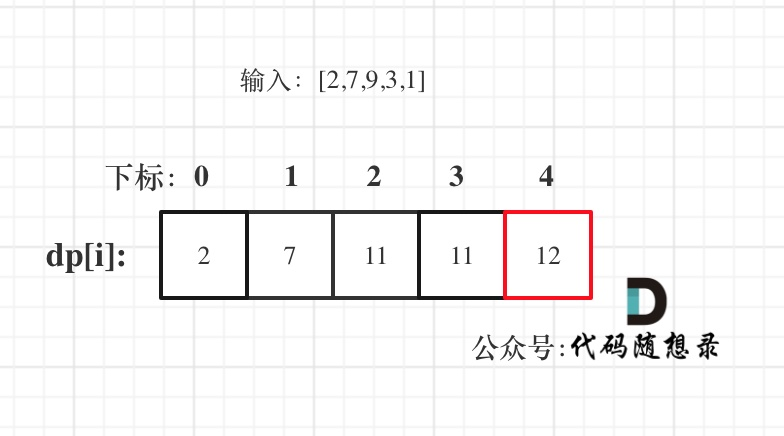

1. dp[i]表示在前i间房屋能偷窃到的最高总金额

2. 确定递推公式，对第i间房屋，有偷和不偷两种情况(i>2):

- 偷窃第i间房屋，那么就不能偷窃第i-1间房屋，偷窃总金额为前i-2间房屋的最高偷窃总金额加上第i间房屋的金额；

- 不偷窃第i间房屋，那么偷窃总金额为前i-1间房屋的最高偷窃总金额。

```java
//递推公式
dp[i] = max(dp[i - 1], dp[i - 2] + nums[i])
```

3. dp数组初始化：递推公式的基础是**dp[0]**和**dp[1]**
```java
dp[0] = nums[0];
dp[1] = Math.max(nums[0], nums[1]);
```

4. 确定遍历顺序：从前向后遍历

5. 举例推导dp数组：以示例二，输入[2,7,9,3,1]为例。


