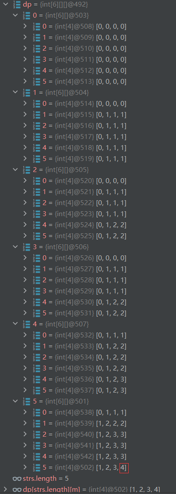

三维动态规划求解

定义`dp[z][i][j]`:
表示在前`z`个字符串（不包含第`z`个字符串）中，使用`i`个`0`和`j`个`1`的情况下最多可以得到的字符串数量

注意`z`的范围问题，这里`z`指的是前`z`个字符串，所以范围是`0 ~ strs.length + 1`，
在遍历的时候也要注意，从`z = 1`开始遍历，每次比较字符串数组中的第`z - 1`个元素，并更新`dp[z]`的值。

递推公式如下代码所示：
```java
if(arr0[z - 1] > i || arr1[z - 1] > j){
        dp[z][i][j] = dp[z - 1][i][j];
}else if(arr0[z - 1] <= i && arr1[z - 1] <= j){
        dp[z][i][j] = Math.max(dp[z - 1][i][j], dp[z - 1][i - arr0[z - 1]][j - arr1[z - 1]] + 1);
}
```

以`["10", "0001", "111001", "1", "0"]`字符串数组为例，
`m = 5, n = 3`，dp数组如下所示，


