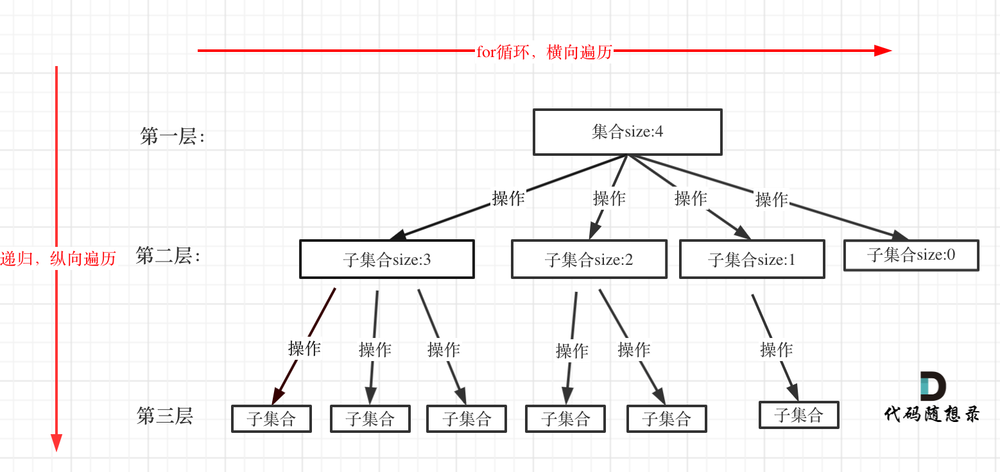

回溯算法可以解决组合问题、切割问题、子集问题、排列问题、棋盘问题。

回溯函数伪代码如下所示：

```java
void backtracking(参数) {
    if (终止条件) {
        存放结果;
        return;
    }
    for (选择：本层集合中元素（树中节点孩子的数量就是集合的大小）) {
        处理节点;
        backtracking(路径，选择列表); // 递归
        回溯，撤销处理结果
    }
}
    
```

回溯搜索的遍历过程如下所示（这里参考代码随想录中的图）：

