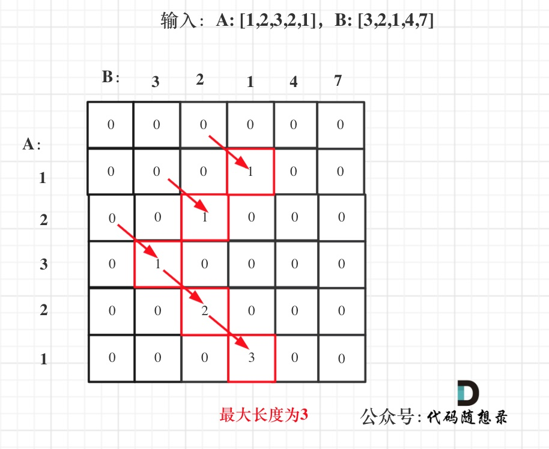

递推公式为

```java
if(nums1[i] == nums2[j]){
    //dp[i][j]表示截止到nums1[i]和nums2[j]的最大公共前缀
    dp[i][j] = dp[i - 1][j - 1] + 1;
    //如果当前nums1[i] == nums2[j]，则公共前缀加1
}
```

以数组[1,2,3,2,1]和数组[3,2,1,4,7]作为输入，dp数组如下所示，


